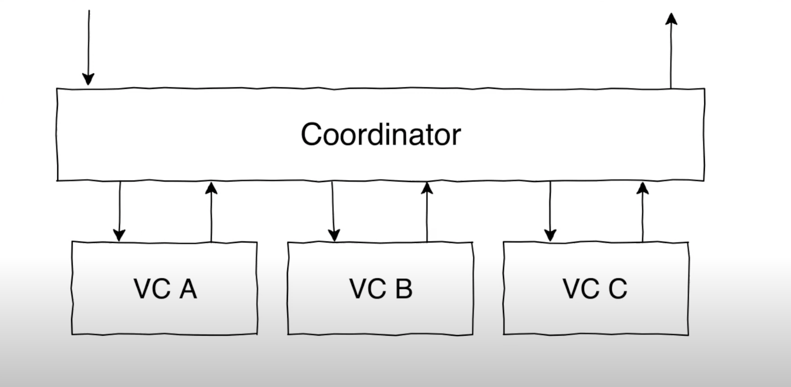

# Coordinator Design Pattern

### Using the coordinator pattern in iOS apps lets us remove the job of app navigation from our view controllers, helping make them more manageable and more reusable, while also letting us adjust our app's flow whenever we need.

 

